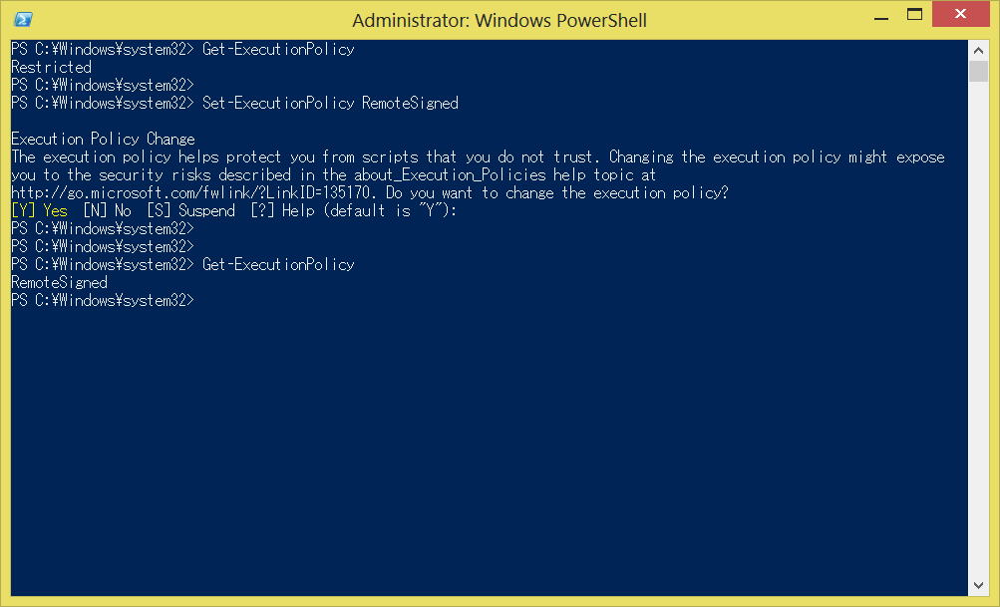

JenkinsOnDesktop
================

あなたのデスクトップにも Jenkins がやってくる!


[English](./README.md)


機能
----
*   Jenkins さんが [Jenkins](http://jenkins-ci.org/) サーバーのジョブ状態を通知してくれます。


必須ソフトウェア
----------------
*   .NET Framework 4.0 以上。
*   Windows PowerShell 2.0 以上。


ダウンロード
------------
*   [http://xpfriend.com/jod/JenkinsOnDesktop-0.9.1.zip](http://xpfriend.com/jod/JenkinsOnDesktop-0.9.1.zip)


セットアップ
------------
### 1. PowerShell スクリプト実行を可能にする。

1.  「Windows PowerShell」を管理者として実行する。
2.  「Set-ExecutionPolicy」コマンドを実行する。

```PowerShell
Set-ExecutionPolicy RemoteSigned
```



*   参考:
    *   [Windows PowerShell スクリプトを実行する](http://technet.microsoft.com/ja-jp/scriptcenter/powershell_owner05.aspx)
    *   [about_Execution_Policies](http://technet.microsoft.com/ja-jp/library/dd347641.aspx)


### 2. "JenkinsOnDesktop.exe" を実行する。


### 3. 「お仕事」タブをクリックする。


### 4. Jenkins サーバーの URL を入力する。


カスタマイズ
------------
執事やお仕事は自由にカスタマイズできます。
カスタマイズ方法は、[JenkinsOnDesktop オーナーズガイド](./Document/OwnersGuide.ja.md)で。


ライセンス
----------
*   This software is released under the MIT License.

*   [jenkins.png](./JenkinsOnDesktop/Resources/Images/jenkins.png)
    and [jenkins_icon.ico](./JenkinsOnDesktop/Resources/Images/jenkins_icon.ico)
    by the [Jenkins project](http://jenkins-ci.org/) / CC BY-SA 3.0.

*   [sad.png](./JenkinsOnDesktop/Resources/Images/sad.png), 
    [oni.png](./JenkinsOnDesktop/Resources/Images/oni.png), 
    [onibi.png](./JenkinsOnDesktop/Resources/Images/onibi.png) 
    and [ninja.png](./JenkinsOnDesktop/Resources/Images/ninja.png)
    by [いまいまさのぶ](http://d.hatena.ne.jp/masanobuimai/) / CC BY-SA 3.0.
