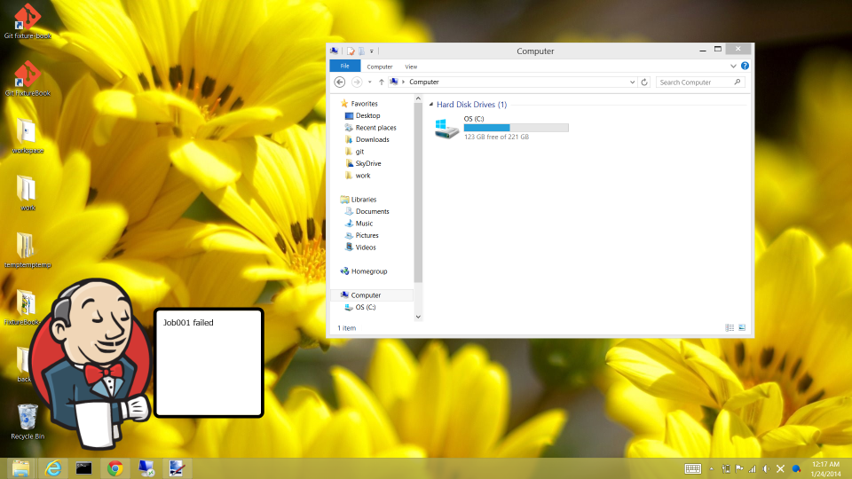
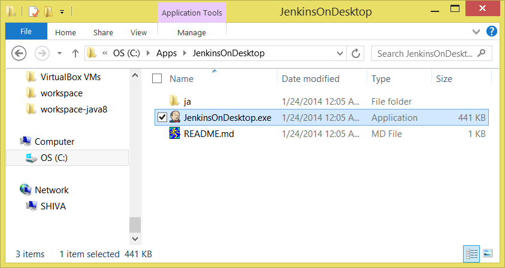
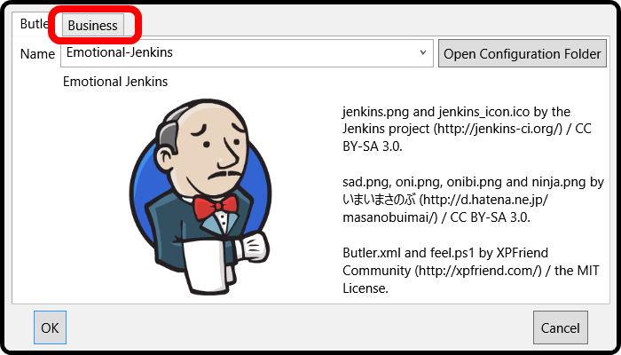
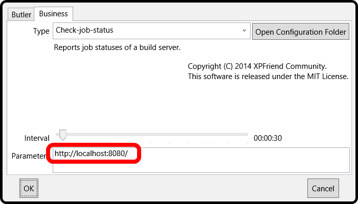

JenkinsOnDesktop
================

Today, Jenkins the butler will come to your desktop.




Feature
-------
*   Mr. Jenkins notifies you of current job status on [Jenkins](http://jenkins-ci.org/) Server.


Requirement
-----------
*   .NET Framework 4.0 or greater.
*   Windows PowerShell 2.0 or greater.


Download
--------
*   [http://xpfriend.com/jod/JenkinsOnDesktop-0.9.zip](http://xpfriend.com/jod/JenkinsOnDesktop-0.9.zip)


Setup
-----
### 1. Enable PowerShell script execution

1.  Run "Windows PowerShell" as administrator.
2.  Execute "Set-ExecutionPolicy" command.

```PowerShell
Set-ExecutionPolicy RemoteSigned
```


*   see also:
    *   [Running Windows PowerShell Scripts](http://technet.microsoft.com/en-us/library/ee176949.aspx)
    *   [about_Execution_Policies](http://technet.microsoft.com/en-us/library/hh847748.aspx)


### 2. Run "JenkinsOnDesktop.exe"




### 3. Click "Business" tab




### 4. Input your Jenkins Server URL




License
-------
*   This software is released under the MIT License.

*   [jenkins.png](./JenkinsOnDesktop/Resources/Images/jenkins.png)
    and [jenkins_icon.ico](./JenkinsOnDesktop/Resources/Images/jenkins_icon.ico)
    by the [Jenkins project](http://jenkins-ci.org/) / CC BY-SA 3.0.

*   [sad.png](./JenkinsOnDesktop/Resources/Images/sad.png), 
    [oni.png](./JenkinsOnDesktop/Resources/Images/oni.png), 
    [onibi.png](./JenkinsOnDesktop/Resources/Images/onibi.png) 
    and [ninja.png](./JenkinsOnDesktop/Resources/Images/ninja.png)
    by [Masanobu Imai](http://d.hatena.ne.jp/masanobuimai/) / CC BY-SA 3.0.
